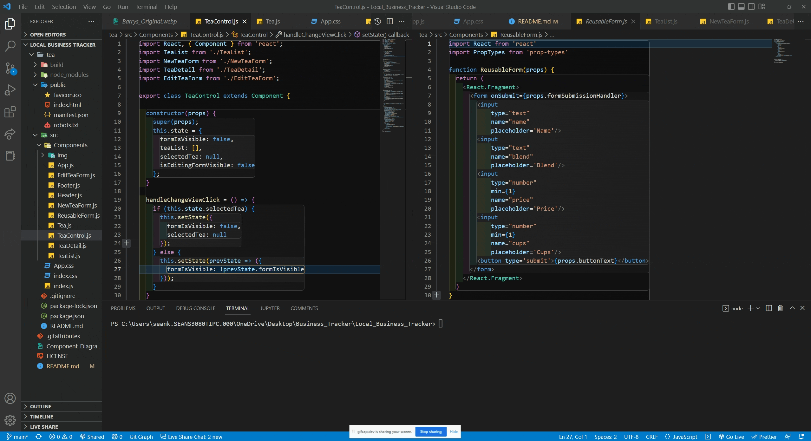
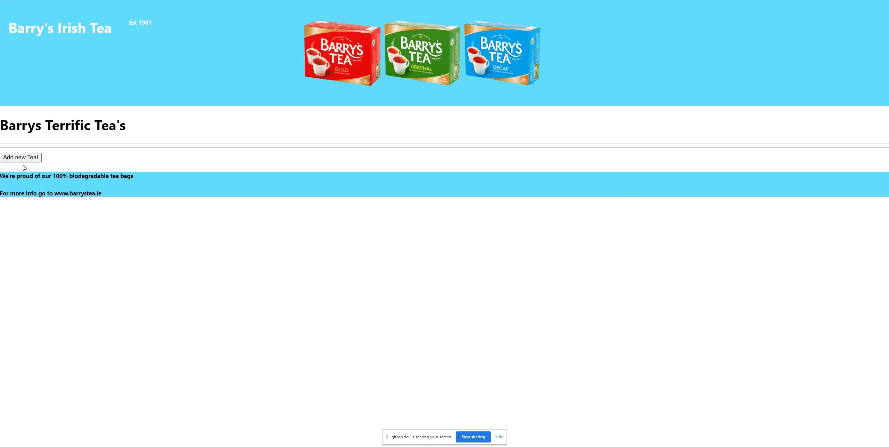

# _Business Inventory Tracker_

#### By _**Sean Keane**_

#### Barry's Irish Tea - Epicodus Code Review 10/21/2022

## Technologies Used

* HTML
* CSS
* JavaScript
* React
* NPM
* ESLint
* Webpack

## Description
_This is a project I created at Epicodus that tracks the number of cups of tea at Barry's Tea Shop.   The user is presented with a "Splash Page" and has the option to add a new tea. The user has the ability to add the name of the tea, blend, price, and cups they desire. Once the user has made their choices, they have the ability to update the tea, delete the tea, restock the tea, buy the tea, and lastly return to the tea list.  When the user has bought all the available tea the buy button will become inoperable.  Developing this application helped grow my understanding of JSX syntax._

## Setup/Installation Requirements

1) Clone this repository to your desktop.
2) Navigate to the now installed directory and open in your editor of choice.
3) Open the directory and `cd to tea`.
7) To build and start the Tea Shop enter: `npm start`.  This should open the app in your default browser.

## For a visual representation of setup and a successfully built application, please consult the attached Gifs.

## Project can be found at:
https://github.com/CanadianRunner/Local_Business_Tracker.git

## Known Bugs

* No known bugs.

## License

If you have any questions or concerns feel free to contact me at code@sean-keane.com

*This is licensed under the MIT license*

Copyright (c) 8-12-2022 **_Sean Keane_**

